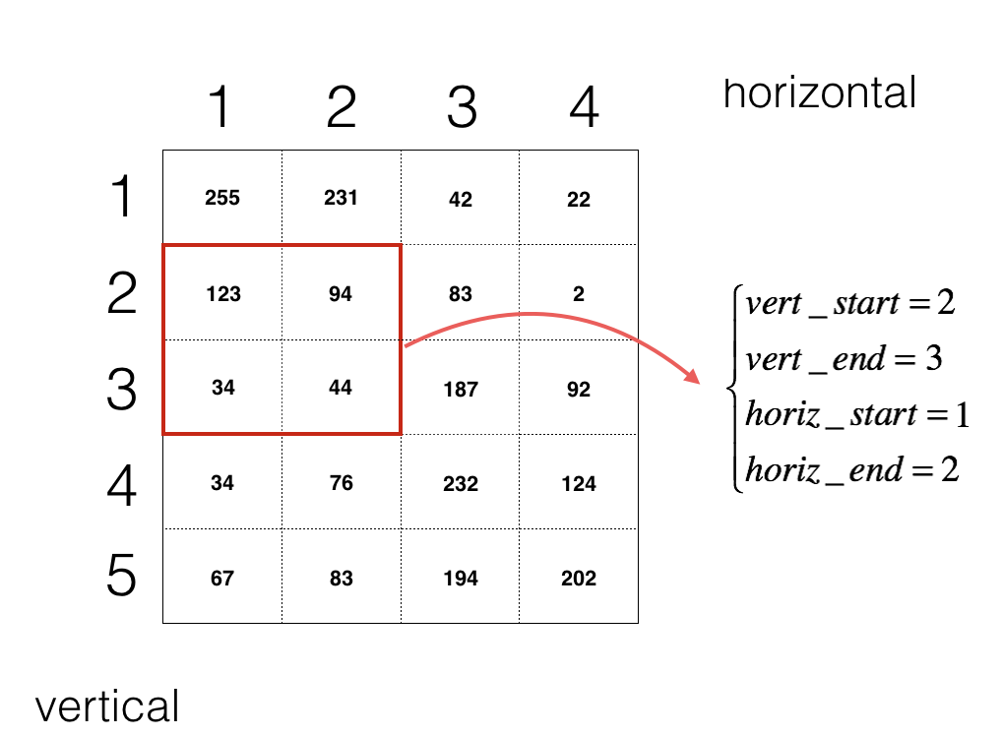
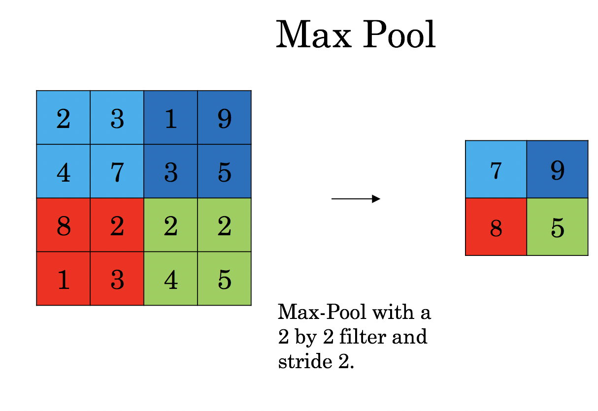
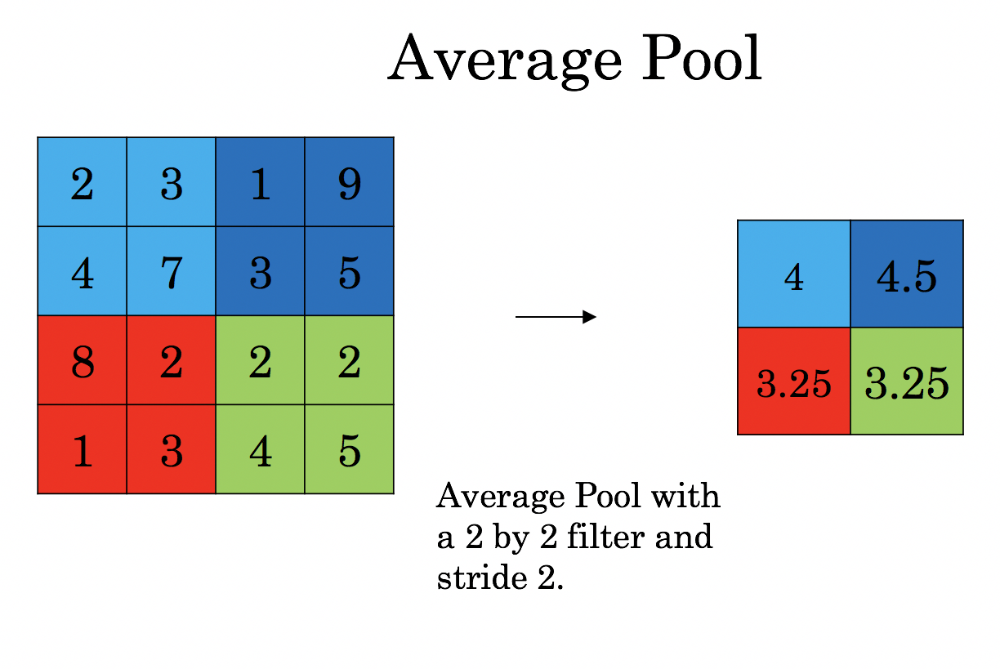

# Convolutional Neural Networks: Step by Step

In this notebook, you will implement convolutional (CONV) and pooling (POOL) layers in R, including both forward propagation and (optionally) backward propagation. 

**Notation**:
- Superscript $[l]$ denotes an object of the $l^{th}$ layer. 
    - Example: $a^{[4]}$ is the $4^{th}$ layer activation. $W^{[5]}$ and $b^{[5]}$ are the $5^{th}$ layer parameters.


- Superscript $(i)$ denotes an object from the $i^{th}$ example. 
    - Example: $x^{(i)}$ is the $i^{th}$ training example input.
    
    
- Lowerscript $i$ denotes the $i^{th}$ entry of a vector.
    - Example: $a^{[l]}_i$ denotes the $i^{th}$ entry of the activations in layer $l$, assuming this is a fully connected (FC) layer.
    
    
- $n_H$, $n_W$ and $n_C$ denote respectively the height, width and number of channels of a given layer. If you want to reference a specific layer $l$, you can also write $n_H^{[l]}$, $n_W^{[l]}$, $n_C^{[l]}$. 
- $n_{H_{prev}}$, $n_{W_{prev}}$ and $n_{C_{prev}}$ denote respectively the height, width and number of channels of the previous layer. If referencing a specific layer $l$, this could also be denoted $n_H^{[l-1]}$, $n_W^{[l-1]}$, $n_C^{[l-1]}$. 

We assume that you are already familiar with `R` and/or have read the [previous DNN notes](http://www.parallelr.com/r-deep-neural-network-from-scratch/). Let's get started!

## 1 - Outline of the Notebook

You will be implementing the building blocks of a convolutional neural network! Each function you will implement will have detailed instructions that will walk you through the steps needed:

- Convolution functions, including:
    - Zero Padding
    - Convolve window 
    - Convolution forward
    - Convolution backward (optional)
- Pooling functions, including:
    - Pooling forward
    - Create mask 
    - Distribute value
    - Pooling backward (optional)
    
This notebook will ask you to implement these functions from scratch in `R`. Then, you will use these functions to build the following model:


**Note** that for every forward function, there is its corresponding backward equivalent. Hence, at every step of your forward module you will store some parameters in a cache. These parameters are used to compute gradients during backpropagation. 

## 2 - Convolutional Neural Networks

Although programming frameworks make convolutions easy to use, they remain one of the hardest concepts to understand in Deep Learning. A convolution layer transforms an input volume into an output volume of different size, as shown below. 


In this part, you will build every step of the convolution layer. You will first implement two helper functions: one for zero padding and the other for computing the convolution function itself. 

### 2.1 - Zero-Padding

Zero-padding adds zeros around the border of an image:


<caption><center> <u> <font color='purple'> **Figure 1** </u><font color='purple'>  : **Zero-Padding**<br> Image (3 channels, RGB) with a padding of 2. </center></caption>

The main benefits of padding are the following:

- It allows you to use a CONV layer without necessarily shrinking the height and width of the volumes. This is important for building deeper networks, since otherwise the height/width would shrink as you go to deeper layers. An important special case is the "same" convolution, in which the height/width is exactly preserved after one layer. 

- It helps us keep more of the information at the border of an image. Without padding, very few values at the next layer would be affected by pixels as the edges of an image.


```R
# FUNCTION: padding for 3-D array
pad3d <- function(input=NULL, stride=1) 
{
  input_N <- dim(input)[1]
  input_H <- dim(input)[2]
  input_W <- dim(input)[3]
  input_C <- dim(input)[4]
  output <- array(0,c(input_N,input_H+2*stride,input_W+2*stride,input_C))
  for (i in 1:input_N) {
    for (j in 1:input_C) {
      output[i,,,j] <- rbind(matrix(0,stride,input_W+2*stride),
                           cbind(matrix(0,input_H,stride),input[i,,,j],matrix(0,input_H,stride)),
                           matrix(0,stride,input_W+2*stride))
    }
  }
  return(output)
}
```

### 2.2 - Single step of convolution 

In this part, implement a single step of convolution, in which you apply the filter to a single position of the input. This will be used to build a convolutional unit, which: 

- Takes an input volume 
- Applies a filter at every position of the input
- Outputs another volume (usually of different size)


<caption><center> <u> <font color='purple'> **Figure 2** </u><font color='purple'>  : **Convolution operation**<br> with a filter of 2x2 and a stride of 1 (stride = amount you move the window each time you slide) </center></caption>

In a computer vision application, each value in the matrix on the left corresponds to a single pixel value, and we convolve a 3x3 filter with the image by multiplying its values element-wise with the original matrix, then summing them up. In this first step of the exercise, you will implement a single step of convolution, corresponding to applying a filter to just one of the positions to get a single real-valued output. 

Later in this notebook, you'll apply this function to multiple positions of the input to implement the full convolutional operation. 


```R
# FUNCTION: conv_single_step

conv_single_step <- function(a_slice_prev, W, b){
  
  # Apply one filter defined by parameters W on a single slice (a_slice_prev) of the output activation 
  # of the previous layer.
  # 
  # Arguments:
  # a_slice_prev -- slice of input data of shape (f, f, n_C_prev)
  # W -- Weight parameters contained in a window - matrix of shape (f, f, n_C_prev)
  # b -- Bias parameters contained in a window - matrix of shape (1, 1, 1)
  # 
  # Returns:
  # Z -- a scalar value, result of convolving the sliding window (W, b) on a slice x of the input data
  f <- dim(a_slice_prev)[1]
  n_C_prev <- dim(a_slice_prev)[3]
  W <- array(W,c(f, f, n_C_prev))
  s <- a_slice_prev * W + b
  Z <- sum(s)
  return(Z)
}
```

### 2.3 - Convolutional Neural Networks - Forward pass

In the forward pass, you will take many filters and convolve them on the input. Each 'convolution' gives you a 2D matrix output. You will then stack these outputs to get a 3D volume: 

<center>
<video width="620" height="440" src="images/conv_kiank.mp4" type="video/mp4" controls>
</video>
</center>

The function below is designed to to convolve the filters W on an input activation A_prev. This function takes as input A_prev, the activations output by the previous layer (for a batch of m inputs), F filters/weights denoted by W, and a bias vector denoted by b, where each filter has its own (single) bias. Finally you also have access to the hyperparameters dictionary which contains the stride and the padding. 

**Hint**: 
1. To select a slice at the upper left corner of a matrix "a_prev" 

This will be useful when you will define `a_slice_prev` below, using the `start/end` indexes you will define.

2. To define a_slice you will need to first define its corners `vert_start`, `vert_end`, `horiz_start` and `horiz_end`. This figure may be helpful for you to find how each of the corner can be defined using h, w, f and s in the code below.


<caption><center> <u> <font color='purple'> **Figure 3** </u><font color='purple'>  : **Definition of a slice using vertical and horizontal start/end (with a 2x2 filter)** <br> This figure shows only a single channel.  </center></caption>


**Reminder**:
The formulas relating the output shape of the convolution to the input shape is:
$$ n_H = \lfloor \frac{n_{H_{prev}} - f + 2 \times pad}{stride} \rfloor +1 $$
$$ n_W = \lfloor \frac{n_{W_{prev}} - f + 2 \times pad}{stride} \rfloor +1 $$
$$ n_C = \text{number of filters used in the convolution}$$

For this exercise, we won't worry about vectorization, and will just implement everything with for-loops.


```R
# FUNCTION: conv_forward

conv_forward <- function(A_prev, W, b, hparameters){
  
  # Implements the forward propagation for a convolution function
  # 
  # Arguments:
  # A_prev -- output activations of the previous layer, array of shape (m, n_H_prev, n_W_prev, n_C_prev)
  # W -- Weights, array of shape (f, f, n_C_prev, n_C)
  # b -- Biases, array of shape (1, 1, 1, n_C)
  # hparameters -- R list containing "stride" and "pad"
  # 
  # Returns:
  # Z -- conv output, array of shape (m, n_H, n_W, n_C)
  # cache -- cache of values needed for the conv_backward() function
  
  # Retrieve dimensions from A_prev's shape
  m <- dim(A_prev)[1]
  n_H_prev <- dim(A_prev)[2]
  n_W_prev <- dim(A_prev)[3]
  n_C_prev <- dim(A_prev)[4]
  
  # Retrieve dimensions from W's shape
  f <- dim(W)[1]
  n_C_prev <- dim(W)[3]
  n_C <- dim(W)[4]
  
  # Retrieve information from "hparameters"
  stride <- hparameters$stride
  pad <- hparameters$pad
  
  # Compute the dimensions of the CONV output volume using the formula given above.
  n_H = floor((n_H_prev-f+2*pad)/stride) + 1
  n_W = floor((n_W_prev-f+2*pad)/stride) + 1
  
  # Initialize the output volume Z with zeros.
  Z <- array(0,c(m, n_H, n_W, n_C))
  
  # Create A_prev_pad by padding A_prev
  A_prev_pad <- pad3d(A_prev, pad)
  
  for (i in 1:m) {                        # loop over the batch of training examples
    a_prev_pad <- A_prev_pad[i,,,]        # Select ith training example's padded activation
    if (is.matrix(a_prev_pad)==TRUE) {
      a_prev_pad <- array(a_prev_pad, c(dim(a_prev_pad)[1],dim(a_prev_pad)[2],1))
    }
    for (h in 1:n_H) {                    # loop over vertical axis of the output volume
      for (w in 1:n_W) {                  # loop over horizontal axis of the output volume
        for (c in 1:n_C) {                # loop over channels (= #filters) of the output volume
          
          # Find the corners of the current "slice"
          vert_start <- (h - 1) * stride + 1
          vert_end <- vert_start + f - 1
          horiz_start <- (w - 1) * stride + 1
          horiz_end <- horiz_start + f - 1
          
          # Use the corners to define the (3D) slice of a_prev_pad
          a_slice_prev <- a_prev_pad[vert_start:vert_end,horiz_start:horiz_end,]
          if (is.matrix(a_slice_prev)==TRUE) {
            a_slice_prev <- array(a_slice_prev, c(dim(a_slice_prev)[1],dim(a_slice_prev)[2],1))
          }
          
          # Convolve the (3D) slice with the correct filter W and bias b, to get back one output neuron.
          Z[i, h, w, c] = conv_single_step(a_slice_prev, W[,,,c], b[,,,c])
        }
        
      }
      
    }
    
  }
  
  # Save information in "cache" for the backprop
  cache <- list(A_prev=A_prev, W=W, b=b, hparameters=hparameters)
  
  list(Z=Z,cache=cache)
}
```

## 3 - Activation

CONV layer should also contain an activation, in which case we would add the following line of code:

```R
# Convolve the window to get back one output neuron
Z = ...
# Apply activation
A = activation(Z)
```

In this notebook, you will use two activation functions:

- **Sigmoid**: $\sigma(Z) = \sigma(W A + b) = \frac{1}{ 1 + e^{-(W A + b)}}$. We have provided you with the `sigmoid` function. This function returns **two** items: the activation value "`a`" and a "`cache`" that contains "`Z`".


- **ReLU**: The mathematical formula for ReLu is $A = RELU(Z) = max(0, Z)$. We have provided you with the `relu` function. This function returns **two** items: the activation value "`A`" and a "`cache`" that contains "`Z`" .

Below are sigmoid and relu activation function. 


```R
# FUNCTION: sigmoid

sigmoid <- function(Z){
  
  # Implements the sigmoid activation in R
  # 
  # Arguments:
  # Z -- array of any shape
  # 
  # Returns:
  # A -- output of sigmoid(z), same shape as Z
  # cache -- returns Z as well, useful during backpropagation
  
  A <- 1/(1+exp(-Z))
  cache <- Z
  list(A = A, cache = cache)
}

sigmoid_backward <- function(dA, cache){
  
  # Implement the backward propagation for a single SIGMOID unit.
  # 
  # Arguments:
  # dA -- post-activation gradient, of any shape
  # cache -- 'Z' where we store for computing backward propagation efficiently
  # 
  # Returns:
  # dZ -- Gradient of the cost with respect to Z
  
  Z <- cache
  
  s <- 1/(1 + exp(-Z))
  dZ <- dA * s * (1-s)
  
  return(dZ)
}

relu <- function(Z){
  
  # Implement the RELU function.
  # 
  # Arguments:
  # Z -- Output of the linear layer, of any shape
  # 
  # Returns:
  # A -- Post-activation parameter, of the same shape as Z
  # cache -- a R list containing "A" ; stored for computing the backward pass efficiently
  
  A <- pmax(Z, 0)
  cache <- Z
  list(A = A, cache = cache)
}

relu_backward <- function(dA, cache){
  
  # Implement the backward propagation for a single RELU unit.
  # 
  # Arguments:
  # dA -- post-activation gradient, of any shape
  # cache -- 'Z' where we store for computing backward propagation efficiently
  # 
  # Returns:
  # dZ -- Gradient of the cost with respect to Z
  
  Z <- cache
  dZ <- array(dA, dim = dim(dA))
  dZ[Z < 0] <- 0
  
  return(dZ)
}
```

## 4 - Pooling layer 

The pooling (POOL) layer reduces the height and width of the input. It helps reduce computation, as well as helps make feature detectors more invariant to its position in the input. The two types of pooling layers are: 

- Max-pooling layer: slides an ($f, f$) window over the input and stores the max value of the window in the output.

- Average-pooling layer: slides an ($f, f$) window over the input and stores the average value of the window in the output.

<table>
<td>

<td>

<td>

<td>
</table>

These pooling layers have no parameters for backpropagation to train. However, they have hyperparameters such as the window size $f$. This specifies the height and width of the fxf window you would compute a max or average over. 

### 4.1 - Forward Pooling
Now, you are going to implement MAX-POOL and AVG-POOL, in the same function. 

As there's no padding, the formulas binding the output shape of the pooling to the input shape is:
$$ n_H = \lfloor \frac{n_{H_{prev}} - f}{stride} \rfloor +1 $$
$$ n_W = \lfloor \frac{n_{W_{prev}} - f}{stride} \rfloor +1 $$
$$ n_C = n_{C_{prev}}$$


```R
# FUNCTION: pool_forward

pool_forward <- function(A_prev, hparameters, mode = "max"){
  
  # Implements the forward pass of the pooling layer
  # 
  # Arguments:
  # A_prev -- Input data, array of shape (m, n_H_prev, n_W_prev, n_C_prev)
  # hparameters -- R list containing "f" and "stride"
  # mode -- the pooling mode you would like to use, defined as a string ("max" or "average")
  # 
  # Returns:
  # A -- output of the pool layer, a numpy array of shape (m, n_H, n_W, n_C)
  # cache -- cache used in the backward pass of the pooling layer, contains the input and hparameters 
  
  # Retrieve dimensions from A_prev's shape
  m <- dim(A_prev)[1]
  n_H_prev <- dim(A_prev)[2]
  n_W_prev <- dim(A_prev)[3]
  n_C_prev <- dim(A_prev)[4]
  
  # Retrieve information from "hparameters"
  stride <- hparameters$stride
  f <- hparameters$f
  
  # Define the dimensions of the output
  n_H = floor(1 + (n_H_prev - f) / stride)
  n_W = floor(1 + (n_W_prev - f) / stride)
  n_C = n_C_prev
  
  A = array(0, c(m, n_H, n_W, n_C))
  
  for (i in 1:m) {                        # loop over the batch of training examples
    for (h in 1:n_H) {                    # loop over vertical axis of the output volume
      for (w in 1:n_W) {                  # loop over horizontal axis of the output volume
        for (c in 1:n_C) {                # loop over channels of the output volume
          
          # Find the corners of the current "slice"
          vert_start <- (h - 1) * stride + 1
          vert_end <- vert_start + f - 1
          horiz_start <- (w - 1) * stride + 1
          horiz_end <- horiz_start + f - 1
          
          # Use the corners to define the current slice on the ith training example of A_prev, channel c.
          a_prev_slice = A_prev[i,vert_start:vert_end,horiz_start:horiz_end,c]
          if (is.matrix(a_prev_slice)==TRUE) {
            a_prev_slice <- array(a_prev_slice, c(dim(a_prev_slice)[1],dim(a_prev_slice)[2],1))
          }
          
          # Compute the pooling operation on the slice. Use an if statment to differentiate the modes.
          A[i, h, w, c] <- ifelse(mode == "max", max(a_prev_slice), mean(a_prev_slice))
        }
      }
    }
  }
  
  # Store the input and hparameters in "cache" for pool_backward()
  cache = list(A_prev=A_prev, hparameters=hparameters)
  
  list(A=A, cache=cache)
}
```

## 5 - Affine layer module

Before implementing the affine layer module, we should first stretch the data to vectors.


```R
# FUNCTION: Strentch data

# array to col
arr2col <- function(X){
  output <- array(X,c(dim(X)[1],(dim(X)[2]*dim(X)[3]*dim(X)[4])))
  cache <- X
  list(output = output, cache = cache)
}

# col to array
col2arr <- function(X, cache){
  output <- array(X,dim = dim(cache))
}
```

Assume that you have initialized your parameters(such as [He initialization)](https://arxiv.org/abs/1502.01852), you will do the affine layer module. You will start by implementing some basic functions that you will use later when implementing the model. You will complete three functions in this order:

- LINEAR
- LINEAR -> ACTIVATION where ACTIVATION will be either ReLU or Sigmoid. 

The Affine forward module (vectorized over all the examples) computes the following equations:

$$Z^{[l]} = W^{[l]}A^{[l-1]} +b^{[l]}\tag{4}$$

where $A^{[0]} = X$. 

**Reminder**:
The mathematical representation of this unit is $Z^{[l]} = W^{[l]}A^{[l-1]} +b^{[l]}$. 


```R
affine_forward <- function(A_prev, W, b){
  
  # Implement the linear part of a layer's forward propagation.
  # 
  # Arguments:
  # A -- activations from previous layer (or input data): (number of examples, size of previous layer)
  # W -- weights matrix: numpy array of shape (size of previous layer, size of current layer)
  # b -- bias vector, numpy array of shape (1, size of the current layer)
  # 
  # Returns:
  # Z -- the input of the activation function, also called pre-activation parameter 
  # cache -- a R list containing "A", "W" and "b" ; stored for computing the backward pass efficiently
  
  Z <- sweep(A_prev %*% W, 2, b, '+')
  cache <- list(A_prev = A_prev, W = W, b = b)
  list(Z = Z, cache = cache)
}

affine_backward <- function(dZ, cache){
  
  # Implement the linear portion of backward propagation for a single layer (layer l)
  # 
  # Arguments:
  # dZ -- Gradient of the cost with respect to the linear output (of current layer l)
  # cache -- tuple of values (A_prev, W, b) coming from the forward propagation in the current layer
  # 
  # Returns:
  # dA_prev -- Gradient of the cost with respect to the activation (of the previous layer l-1), same shape as A_prev
  # dW -- Gradient of the cost with respect to W (current layer l), same shape as W
  # db -- Gradient of the cost with respect to b (current layer l), same shape as b
  
  A_prev <- cache$A_prev
  W <- cache$W
  b <- cache$b
  m <- dim(A_prev)[1]
  
  dW <- (t(A_prev) %*% dZ) / m
  db <- (matrix(colSums(dZ),1,dim(b)[2])) / m
  dA_prev <- dZ %*% t(W)
  
  list(dA_prev = dA_prev, dW = dW, db = db)
  
}
```

The affine activation module will computes the following equations:

$$A^{[l]} = activation(Z^{[l]})$$

where ACTIVATION will be either ReLU or Sigmoid.


```R
# FUNCTION: affine_activation_forward

affine_activation_forward <- function(A_prev, W, b, activation = "relu"){
  
  # Implement the forward propagation for the LINEAR->ACTIVATION layer
  # 
  # Arguments:
  # A_prev -- activations from previous layer (or input data): (size of previous layer, number of examples)
  # W -- weights matrix: numpy array of shape (size of current layer, size of previous layer)
  # b -- bias vector, numpy array of shape (size of the current layer, 1)
  # activation -- the activation to be used in this layer, stored as a text string: "sigmoid" or "relu"
  # 
  # Returns:
  # A -- the output of the activation function, also called the post-activation value 
  # cache -- a R list containing "linear_cache" and "activation_cache";
  # stored for computing the backward pass efficiently
  
  if (activation == "sigmoid") {
    affine_forward_output <- affine_forward(A_prev, W, b)
    Z <- affine_forward_output$Z
    affine_cache <- affine_forward_output$cache
    sigmoid_output <- sigmoid(Z)
    A <- sigmoid_output$A
    activation_cache <- sigmoid_output$cache
  } else if (activation == "relu") {
    affine_forward_output <- affine_forward(A_prev, W, b)
    Z <- affine_forward_output$Z
    affine_cache <- affine_forward_output$cache
    relu_output <- relu(Z)
    A <- relu_output$A
    activation_cache <- relu_output$cache
  } else if(activation == "NULL"){
    affine_forward_output <- affine_forward(A_prev, W, b)
    A <- affine_forward_output$Z
    activation_cache <- affine_cache <- affine_forward_output$cache
  }
  
  cache = list(affine_cache = affine_cache, activation_cache = activation_cache)
  
  list(A = A, cache = cache)
}
    
affine_activation_backward <- function(dA, cache, activation){
  
  # Implement the backward propagation for the LINEAR->ACTIVATION layer.
  # 
  # Arguments:
  # dA -- post-activation gradient for current layer l 
  # cache -- tuple of values (linear_cache, activation_cache) we store for computing backward propagation efficiently
  # activation -- the activation to be used in this layer, stored as a text string: "sigmoid" or "relu"
  # 
  # Returns:
  # dA_prev -- Gradient of the cost with respect to the activation (of the previous layer l-1), same shape as A_prev
  # dW -- Gradient of the cost with respect to W (current layer l), same shape as W
  # db -- Gradient of the cost with respect to b (current layer l), same shape as b
  
  affine_cache <- cache$affine_cache
  activation_cache <- cache$activation_cache
  
  if (activation == "relu") {
    dZ <- relu_backward(dA, activation_cache)
  } else if (activation == "sigmoid") {
    dZ <- sigmoid_backward(dA, activation_cache)
  } else if (activation == "NULL") {
    dZ <- dA
  }
  
  affine_backward_output <- affine_backward(dZ, affine_cache)
  dA_prev <- affine_backward_output$dA_prev
  dW <- affine_backward_output$dW
  db <- affine_backward_output$db
  
  list(dA_prev = dA_prev, dW = dW, db =db)
}
```

## 6 - Cost function

Now you will implement forward and backward propagation. You need to compute the cost, because you want to check if your model is actually learning.

### 6.1 - Softmax function

The softmax function, or normalized exponential function, is a generalization of the logistic function that "squashes" a K-dimensional vector $z$, of arbitrary real values to a K-dimensional vector $\sigma(Z)$ of real values in the range [0, 1] that add up to 1. The function is given by

$$
\sigma(Z)_{j} = \frac{e^{Z_{j}}}{\sum_{k=1}^{K}e^{z_{k}}}\qquad  for\ j = 1, …, K.
$$


```R
# FUNCTION: Softmax

logsumexp <- function (x) {
  y <- max(x)
  y <- y + log(sum(exp(x - y)))
}

softmax <- function (x) {
  probs <- exp(x - logsumexp(x))
  cache <- x
  list(probs = probs, cache = cache)
}
```

### 6.2 - Cross-entropy loss

In binary classification, where the number of classes MM equals 2, cross-entropy can be calculated as:

$$-{(y\log(p) + (1 - y)\log(1 - p))}$$

If $M > 2$ (i.e. multiclass classification), we calculate a separate loss for each class label per observation and sum the result.

$$-\sum_{c=1}^My_{o,c}\log(p_{o,c})$$

**Note**

- M - number of classes (dog, cat, fish)
- log - the natural log
- y - binary indicator (0 or 1) if class label $c$ is the correct classification for observation $o$
- p - predicted probability observation $o$ is of class $c$


```R
# FUNCTION: cross_entropy_cost

cross_entropy_cost <- function(AL, Y, batch_size){
  
  # create index for both row and col
  Y.set   <- sort(unique(Y))
  Y.index <- cbind(1:batch_size, match(Y, Y.set))
  
  corect.logprobs <- -log(AL[Y.index])
  loss  <- sum(corect.logprobs)/batch_size
  
  cache <- list(AL = AL, Y.index = Y.index)
  list(loss = loss, cache = cache)
  
}
```

## 7 - Backpropagation in convolutional neural networks

In modern deep learning frameworks, you only have to implement the forward pass, and the framework takes care of the backward pass, so most deep learning engineers don't need to bother with the details of the backward pass. The backward pass for convolutional networks is complicated. If you wish however, you can work through this portion of the notebook to get a sense of what backprop in a convolutional network looks like. 

### 7.1 - Convolutional layer backward pass 

Let's start by implementing the backward pass for a CONV layer. 

#### 7.1.1 - Computing dA:
This is the formula for computing $dA$ with respect to the cost for a certain filter $W_c$ and a given training example:

$$ dA += \sum _{h=0} ^{n_H} \sum_{w=0} ^{n_W} W_c \times dZ_{hw} \tag{1}$$

Where $W_c$ is a filter and $dZ_{hw}$ is a scalar corresponding to the gradient of the cost with respect to the output of the conv layer Z at the hth row and wth column (corresponding to the dot product taken at the ith stride left and jth stride down). Note that at each time, we multiply the the same filter $W_c$ by a different dZ when updating dA. We do so mainly because when computing the forward propagation, each filter is dotted and summed by a different a_slice. Therefore when computing the backprop for dA, we are just adding the gradients of all the a_slices. 


#### 7.1.2 - Computing dW:
This is the formula for computing $dW_c$ ($dW_c$ is the derivative of one filter) with respect to the loss:

$$ dW_c  += \sum _{h=0} ^{n_H} \sum_{w=0} ^ {n_W} a_{slice} \times dZ_{hw}  \tag{2}$$

Where $a_{slice}$ corresponds to the slice which was used to generate the acitivation $Z_{ij}$. Hence, this ends up giving us the gradient for $W$ with respect to that slice. Since it is the same $W$, we will just add up all such gradients to get $dW$. 


#### 7.1.3 - Computing db:

This is the formula for computing $db$ with respect to the cost for a certain filter $W_c$:

$$ db = \sum_h \sum_w dZ_{hw} \tag{3}$$

As you have previously seen in basic neural networks, db is computed by summing $dZ$. In this case, you are just summing over all the gradients of the conv output (Z) with respect to the cost. 


```R
# FUNCTION: conv backward

conv_backward <- function(dZ, cache){
  
  # Implement the backward propagation for a convolution function
  # 
  # Arguments:
  # dZ -- gradient of the cost with respect to the output of the conv layer (Z), array of shape (m, n_H, n_W, n_C)
  # cache -- cache of values needed for the conv_backward(), output of conv_forward()
  # 
  # Returns:
  # dA_prev -- gradient of the cost with respect to the input of the conv layer (A_prev),
  # array of shape (m, n_H_prev, n_W_prev, n_C_prev)
  # dW -- gradient of the cost with respect to the weights of the conv layer (W)
  # array of shape (f, f, n_C_prev, n_C)
  # db -- gradient of the cost with respect to the biases of the conv layer (b)
  # array of shape (1, 1, 1, n_C)
  
  # Retrieve information from "cache"
  A_prev <- cache$A_prev
  W <- cache$W
  b <- cache$b
  hparameters <- cache$hparameters
  
  # Retrieve dimensions from A_prev's shape
  m <- dim(A_prev)[1]
  n_H_prev <- dim(A_prev)[2]
  n_W_prev <- dim(A_prev)[3]
  n_C_prev <- dim(A_prev)[4]
  
  # Retrieve dimensions from W's shape
  f <- dim(W)[1]
  n_C_prev <- dim(W)[3]
  n_C <- dim(W)[4]
  
  # Retrieve information from "hparameters"
  stride <- hparameters$stride
  pad <- hparameters$pad
  
  # Retrieve dimensions from dZ's shape
  m <- dim(dZ)[1]
  n_H <- dim(dZ)[2]
  n_W <- dim(dZ)[3]
  n_C <- dim(dZ)[4]
  
  # Initialize dA_prev, dW, db with the correct shapes
  dA_prev <- array(0, c(m, n_H_prev, n_W_prev, n_C_prev))
  dW <- array(0, c(f, f, n_C_prev, n_C))
  db <- array(0, c(1, 1, 1, n_C))
  
  # Pad A_prev and dA_prev
  A_prev_pad <- pad3d(A_prev, pad)
  dA_prev_pad <- pad3d(dA_prev, pad)
  
  for (i in 1:m) {                                 # loop over the training examples
    
    # select ith training example from A_prev_pad and dA_prev_pad
    a_prev_pad <- A_prev_pad[i,,,]
    if (is.matrix(a_prev_pad)==TRUE) {
      a_prev_pad <- array(a_prev_pad, c(dim(a_prev_pad)[1],dim(a_prev_pad)[2],1))
    }
    da_prev_pad <- dA_prev_pad[i,,,]
    if (is.matrix(da_prev_pad)==TRUE) {
      da_prev_pad <- array(da_prev_pad, c(dim(da_prev_pad)[1],dim(da_prev_pad)[2],1))
    }
    
    for (h in 1:n_H) {                             # loop over vertical axis of the output volume
      for (w in 1:n_W) {                           # loop over horizontal axis of the output volume
        for (c in 1:n_C) {                         # loop over the channels of the output volume
          
          # Find the corners of the current "slice"
          vert_start <- (h - 1) * stride + 1
          vert_end <- vert_start + f - 1
          horiz_start <- (w - 1) * stride + 1
          horiz_end <- horiz_start + f - 1
          
          # Use the corners to define the slice from a_prev_pad
          a_slice <- a_prev_pad[vert_start:vert_end, horiz_start:horiz_end, ]
          
          # Update gradients for the window and the filter's parameters using the code formulas given above
          da_prev_pad[vert_start:vert_end, horiz_start:horiz_end, ] <- da_prev_pad[vert_start:vert_end, horiz_start:horiz_end, ] + W[,,,c] * dZ[i, h, w, c]
          dW[,,,c] <- dW[,,,c] + a_slice * dZ[i, h, w, c]
          db[,,,c] <- db[,,,c] + dZ[i, h, w, c]
        }
      }
      
    }
    
    # Set the ith training example's dA_prev to the unpaded da_prev_pad (Hint: use X[pad:-pad, pad:-pad, :])
    dA_prev[i, , , ] <- da_prev_pad[(pad+1):(pad+n_H_prev), (pad+1):(pad+n_W_prev), ]
  }
  
  list(dA_prev = dA_prev, dW = dW, db = db)
}
```

## 7.2 Pooling layer - backward pass

Next, let's implement the backward pass for the pooling layer, starting with the MAX-POOL layer. Even though a pooling layer has no parameters for backprop to update, you still need to backpropagation the gradient through the pooling layer in order to compute gradients for layers that came before the pooling layer. 

### 7.2.1 Max pooling - backward pass  

Before jumping into the backpropagation of the pooling layer, you are going to build a helper function called `create_mask_from_window()` which does the following: 

$$ X = \begin{bmatrix}
1 && 3 \\
4 && 2
\end{bmatrix} \quad \rightarrow  \quad M =\begin{bmatrix}
0 && 0 \\
1 && 0
\end{bmatrix}\tag{4}$$

As you can see, this function creates a "mask" matrix which keeps track of where the maximum of the matrix is. True (1) indicates the position of the maximum in X, the other entries are False (0). You'll see later that the backward pass for average pooling will be similar to this but using a different mask.  


```R
# FUNCTION: create_mask_from_window

create_mask_from_window <- function(x){
  
  # Creates a mask from an input matrix x, to identify the max entry of x.
  # 
  # Arguments:
  # x -- Array of shape (f, f)
  # 
  # Returns:
  # mask -- Array of the same shape as window, contains a True at the position corresponding to the max entry of x.

  mask <- (x == max(x)) + 0
}
```

Why do we keep track of the position of the max? It's because this is the input value that ultimately influenced the output, and therefore the cost. Backprop is computing gradients with respect to the cost, so anything that influences the ultimate cost should have a non-zero gradient. So, backprop will "propagate" the gradient back to this particular input value that had influenced the cost. 

### 7.2.2 - Average pooling - backward pass 

In max pooling, for each input window, all the "influence" on the output came from a single input value--the max. In average pooling, every element of the input window has equal influence on the output. So to implement backprop, you will now implement a helper function that reflects this.

For example if we did average pooling in the forward pass using a 2x2 filter, then the mask you'll use for the backward pass will look like: 
$$ dZ = 1 \quad \rightarrow  \quad dZ =\begin{bmatrix}
1/4 && 1/4 \\
1/4 && 1/4
\end{bmatrix}\tag{5}$$

This implies that each position in the $dZ$ matrix contributes equally to output because in the forward pass, we took an average. 


```R
# FUNCTION: distribute_value

distribute_value <- function(dz, shape){
  
  # Distributes the input value in the matrix of dimension shape
  # 
  # Arguments:
  # dz -- input scalar
  # shape -- the shape (n_H, n_W) of the output matrix for which we want to distribute the value of dz
  # 
  # Returns:
  # a -- Array of size (n_H, n_W) for which we distributed the value of dz
  
  # Retrieve dimensions from shape
  n_H <- shape[1]
  n_W <- shape[2]
  
  # Compute the value to distribute on the matrix
  average <- dz / (n_H * n_W)
  
  # Create a matrix where every entry is the "average" value
  a = matrix(average, n_H, n_W)
  
  return(a)
}
```

### 7.2.3 Putting it together: Pooling backward 

You now have everything you need to compute backward propagation on a pooling layer.


```R
# FUNCTION: pool_backward

pool_backward <- function(dA, cache, mode = "max"){
  
  # Implements the backward pass of the pooling layer
  # 
  # Arguments:
  # dA -- gradient of cost with respect to the output of the pooling layer, same shape as A
  # cache -- cache output from the forward pass of the pooling layer, contains the layer's input and hparameters 
  # mode -- the pooling mode you would like to use, defined as a string ("max" or "average")
  # 
  # Returns:
  # dA_prev -- gradient of cost with respect to the input of the pooling layer, same shape as A_prev
  
  # Retrieve information from cache
  A_prev <- cache$A_prev
  hparameters <- cache$hparameters
  
  # Retrieve hyperparameters from "hparameters" 
  stride <- hparameters$stride
  f <- hparameters$f
  
  # Retrieve dimensions from A_prev's shape and dA's shape
  m <- dim(A_prev)[1]
  n_H_prev <- dim(A_prev)[2]
  n_W_prev <- dim(A_prev)[3]
  n_C_prev <- dim(A_prev)[4]
  
  m <- dim(dA)[1]
  n_H <- dim(dA)[2]
  n_W <- dim(dA)[3]
  n_C <- dim(dA)[4]

  # Initialize dA_prev with zeros
  dA_prev <- array(0, c(m, n_H_prev, n_W_prev, n_C_prev))
  
  for (i in 1:m) {
    # select training example from A_prev
    a_prev = A_prev[i,,,]
    
    for (h in 1:n_H) {
      for (w in 1:n_W) {
        for (c in 1:n_C) {
          
          # Find the corners of the current "slice"
          vert_start <- (h - 1) * stride + 1
          vert_end <- vert_start + f - 1
          horiz_start <- (w - 1) * stride + 1
          horiz_end <- horiz_start + f - 1
          
          # Compute the backward propagation in both modes.
          if(mode == "max"){
            
            # Use the corners and "c" to define the current slice from a_prev
            a_prev_slice <- a_prev[vert_start:vert_end,horiz_start:horiz_end,c]
            # Create the mask from a_prev_slice
            mask <- create_mask_from_window(a_prev_slice)
            # Set dA_prev to be dA_prev + (the mask multiplied by the correct entry of dA)
            dA_prev[i, vert_start: vert_end, horiz_start: horiz_end, c] <- dA_prev[i, vert_start: vert_end, horiz_start: horiz_end, c] + mask * dA[i,h,w,c]
            
          } else if(mode == "average"){
            # Get the value a from dA
            da = dA[i,h,w,c]
            # Define the shape of the filter as fxf 
            shape = c(f,f)
            # Distribute it to get the correct slice of dA_prev. i.e. Add the distributed value of da. 
            dA_prev[i, vert_start: vert_end, horiz_start: horiz_end, c] <- dA_prev[i, vert_start: vert_end, horiz_start: horiz_end, c] + distribute_value(da, shape)
            
          }
        }
      }
    }
  }
  
  return(dA_prev)
}
```

Now that we have complete every main function in convolution model, we can use them to create a MNIST classifier, try it out!
